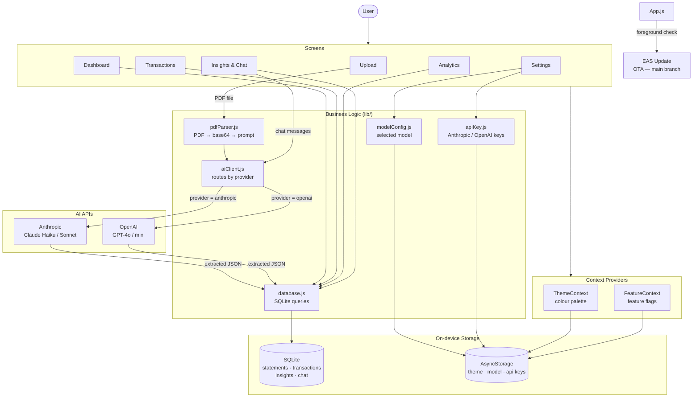

# Expense Tracker

A personal Android app that parses your credit card statements using Claude AI, consolidates all expenses into one place, and gives you charts, insights, and a conversational interface to understand your spending.

## Features

- **Upload** — pick one or multiple PDF statements at once; AI extracts all transactions automatically
- **Dashboard** — monthly summary, category breakdown with progress bars, recent transactions
- **Transactions** — searchable, filterable list grouped by date across all statements
- **Analytics** — pie chart, daily/monthly bar chart, trend line, expandable category breakdown, subscription detection, and merchant trend search
- **Insights** — AI-generated saving tips + conversational chatbot that knows your full transaction history
- **Themes** — 5 colour themes (Dune, Sage, Dusk, Ember, Cosmos) persisted across restarts
- **Config flags** — toggle non-critical features on/off from Settings
- **Duplicate protection** — filename-level and transaction-level deduplication prevents double-counting
- **On-device storage** — all data lives in SQLite on your phone, never sent to any server

## Architecture



## Tech stack

| Layer | Library |
|-------|---------|
| Framework | React Native (Expo SDK 54) |
| Navigation | React Navigation v7 (bottom tabs) |
| Database | expo-sqlite v16 |
| File picking | expo-document-picker |
| File reading | expo-file-system (next API) |
| Charts | react-native-gifted-charts |
| AI (PDF parsing + chat) | Anthropic API (Claude Haiku / Sonnet) or OpenAI API (GPT-4o / mini) |
| Model selection | Persisted in AsyncStorage via `lib/modelConfig.js` |
| OTA updates | EAS Update — `main` branch, checked on every foreground |
| Theming | React Context + AsyncStorage |
| Testing | Jest 29 + jest-expo |

## Project structure

```
expense-tracker/
├── App.js                      # Root — navigation + providers
├── app.json                    # Expo config + Android package name
├── eas.json                    # EAS Build profiles (development, preview, production)
├── .env                        # API key (gitignored)
├── assets/                     # App icon and splash screen
├── constants/
│   ├── theme.js                # FONTS, SPACING, RADIUS constants
│   ├── themes.js               # 5 colour palettes
│   └── categories.js           # Category colours and emojis
├── lib/
│   ├── database.js             # All SQLite queries
│   ├── pdfParser.js            # Claude API call + JSON extraction
│   ├── ThemeContext.js         # Theme provider + useTheme hook
│   └── FeatureContext.js       # Feature flags provider + useFeatures hook
├── components/
│   ├── StatCard.js             # Reusable summary card
│   ├── TransactionItem.js      # Single transaction row
│   └── MarkdownText.js         # Lightweight markdown renderer for chat
├── screens/
│   ├── DashboardScreen.js
│   ├── UploadScreen.js
│   ├── TransactionsScreen.js
│   ├── AnalyticsScreen.js
│   ├── InsightsScreen.js
│   └── SettingsScreen.js
└── __tests__/
    ├── pdfParser.test.js       # JSON extraction, base64, month inference
    ├── database.test.js        # Fingerprinting, period date logic
    ├── subscriptions.test.js   # Subscription detection algorithm
    └── chatContext.test.js     # Transaction context builder, markdown parser
```

## Setup

### Prerequisites

- Node.js 18+
- An [Anthropic API key](https://console.anthropic.com/settings/keys)
- [EAS CLI](https://docs.expo.dev/eas/) for building APKs

### 1. Install dependencies

```bash
cd expense-tracker
npm install
```

### 2. Add your API key

```bash
cp .env.example .env
# Edit .env and replace "your-key-here" with your actual key
```

```
EXPO_PUBLIC_ANTHROPIC_API_KEY=sk-ant-...
```

### 3. Run tests

```bash
npm test
```

### 4a. Development (requires server running on laptop)

Install the dev client APK once (built via EAS), then:

```bash
npx expo start --dev-client
```

Open the dev client app on your phone and connect — changes hot-reload instantly.

### 4b. Production (standalone APK, no laptop needed)

```bash
export PATH="$HOME/.npm-global/bin:$PATH"
eas build -p android --profile preview
```

EAS builds in the cloud (~10 min) and gives you a download link. Install the APK and it runs fully standalone.

## Adding a feature flag

1. Open `lib/FeatureContext.js`
2. Add an entry to `FEATURES`:

```js
export const FEATURES = {
  // existing flags ...
  myNewFeature: { label: 'My Feature', desc: 'What it does' },
};
```

3. Gate the UI in the relevant screen:

```jsx
const { flags } = useFeatures();
{flags.myNewFeature && <MyComponent />}
```

The toggle appears automatically in Settings → Config.

## Adding chat instructions

Open `screens/InsightsScreen.js` and append to `CHAT_INSTRUCTIONS`:

```js
const CHAT_INSTRUCTIONS = [
  'Positive amounts mean credited back to the account.',
  'Negative amounts mean debited from the account.',
  // 'Your new rule here.',
];
```

Claude sees these as numbered rules in every conversation.

## Future work

### Statement import automation
Currently statements are uploaded manually. The following approaches were discussed:

- **Android Share Intent** — add an intent filter so PDFs can be shared directly from Gmail/any app into the expense tracker with one tap, auto-navigating to the Upload screen. Requires an `intentFilter` in `app.json` and a handler in `UploadScreen.js`. Estimated effort: ~1 hour.
- **n8n email watcher + push notification** — n8n monitors the inbox for bank statement emails, extracts the PDF attachment, and sends an Expo push notification. User taps the notification to open the app. Requires an n8n workflow and Expo Push API integration.
- **Full automation with backend** — n8n watches email, downloads the PDF, calls Claude API, and pushes the processed transactions to the app via a sync endpoint. Completely hands-off but requires a small backend service.

### Multi-user / sharing the app
The Anthropic API key is currently baked into the APK at build time. To share the app with others:

- **Per-user API key input** — re-add the key input screen (existed in an early version, removed for personal use). Each person signs up at `console.anthropic.com` (free credits available) and enters their own key on first launch.
- **Backend proxy** — a single server holds the key, the app calls the server, the server calls Anthropic. Users need no account or key of their own. Most distribution-friendly option.

### CSV statement support
Some banks offer CSV exports alongside PDFs. CSV parsing is deterministic and cheaper (no AI call needed). A CSV parser could run entirely on-device, saving API credits for accounts that offer it.

### iOS support
The app is Android-only. An iOS build requires an Apple Developer account ($99/year) and minor UI adjustments for iOS-specific safe areas and file picker behaviour. The codebase is already cross-platform React Native — no logic changes needed.

### Cloud sync / multi-device
All data currently lives on-device in SQLite. A cloud sync layer (e.g. Supabase or Firebase) would allow the same data to be accessed across multiple devices and serve as a backup.

### Budget tracking & alerts
- Set monthly budgets per category
- Push notifications when approaching or exceeding a budget
- "Overspent" indicator on the Dashboard

### Expanded subscription detection
The current keyword list covers major services. A longer-term improvement is a community-maintained list or a machine-learning classifier that detects subscription patterns without relying on merchant name matching.

### Google Drive / iCloud auto-import
Watch a specific folder for new PDF files and auto-import them when the app is opened, removing even the manual "pick file" step.

---

## Data model

```sql
statements   (id, filename, month, card_name, uploaded_at)
transactions (id, statement_id, date, description, merchant, amount, category)
insights     (month, tips, generated_at)
chat_sessions  (id, title, created_at)
chat_messages  (id, session_id, role, content, created_at)
```

- `amount > 0` = debit (purchase)
- `amount < 0` = credit (refund, cashback)
- Transaction IDs are deterministic fingerprints — uploading the same statement twice silently skips duplicates.
